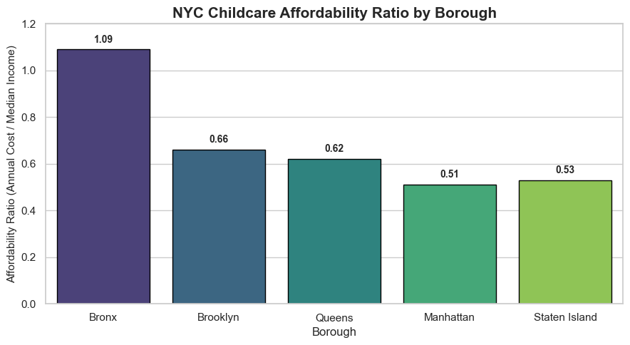

# 🏙️ NYC Childcare Affordability Analysis  

This project analyzes childcare affordability across New York City boroughs using Python and data visualization techniques.  

---

## 📘 Overview  
The goal is to understand how childcare costs relate to household income across NYC’s boroughs.  
Using open datasets (DOHMH inspections and median-income data), the analysis computes an  
**Affordability Ratio = Annual Childcare Cost / Median Income** and visualizes how affordability differs by borough.  

---

## 🧩 Files  
- **Data Analysis Preparation.ipynb** – Data cleaning and preprocessing  
- **Childcare Affordibility Project.ipynb** – Visualization and affordability computation  
- **DOHMH_Childcare_Center_Inspections_20251012.csv** – Raw dataset  
- **NYC_Childcare_Affordability_Summary.xlsx** – Final summarized data  
- **Affordibility.png** – Bar chart comparing affordability by borough  

---

## 🧠 Key Insights  
- Bronx shows the **least affordable** childcare due to lower median income.  
- Manhattan and Queens appear **more affordable** despite similar childcare costs.  
- The citywide average annual childcare cost used = **$51,100**.  

---

## 🧰 Tools & Libraries  
Python | Pandas | NumPy | Seaborn | Matplotlib | Jupyter Notebook  

---

## 📊 Visualization  
Final bar chart comparing affordability across NYC boroughs:  
  

---

## 🏁 Conclusion  
Childcare affordability varies widely across NYC.  
Income differences—not cost differences—drive most affordability gaps.  

---

👨‍💻 **Created by:** Md Hasib Uddin, Simo Xiang, Brandon Caceres
🎓 Master’s Student — Business Analytics, Baruch College  
📍 New York City  
